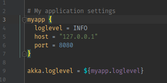
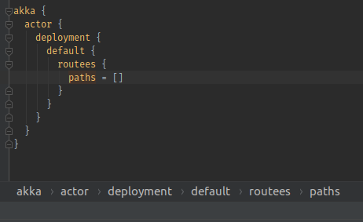
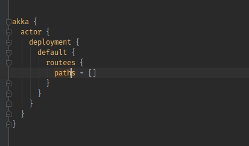
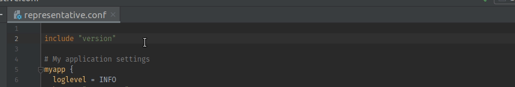
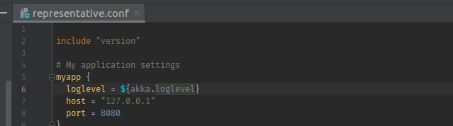
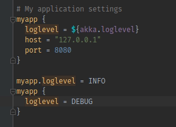
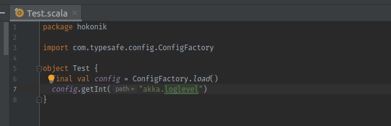
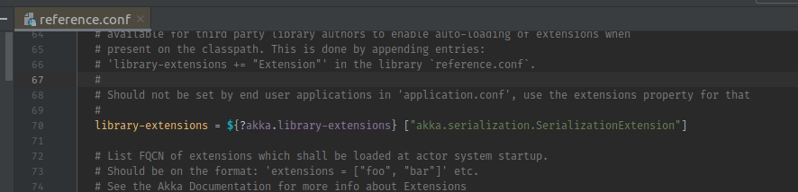
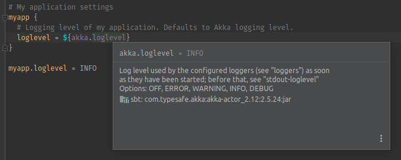
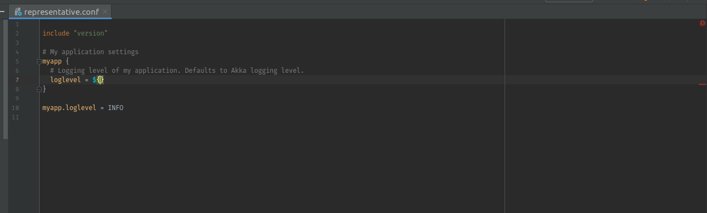

# IntelliJ IDEA Plugin for [HOCON](https://github.com/lightbend/config/blob/master/HOCON.md)

[Plugin page](https://plugins.jetbrains.com/plugin/10481-hocon)

## Features and usage instructions

* HOCON file type

  Files with `*.conf` extensions are automatically interpreted as HOCON files. Because `*.conf` is a common extension,
  you can change this in `File -> Settings -> Editor -> File Types`.
  
* Syntax highlighting, brace matching and code folding

  
  
* Configurable color scheme in `File -> Settings -> Editor -> Color Scheme -> HOCON`

* Code formatter (the IntelliJ **Reformat Code** action) along with configurable code style in 
  `File -> Settings -> Editor -> Code Style -> HOCON`
  
* Breadcrumbs
  
  
  
* **Copy Reference** action

  Use this action (e.g. using `Ctrl+Alt+Shift+C`) when having the caret at HOCON key in order to copy full path
  of the HOCON property.
  
* **Move Statement Up/Down** action which can also move entries in and out of objects

  
  
* Resolution of HOCON includes with navigation

  
  
* Resolution of HOCON substitutions with navigation

  Substitutions are resolved in the current file, all the included files and finally in all the `reference.conf` files
  that can be found on the classpath (e.g. in library JARs). This reflects the way HOCON is usually loaded and resolved
  in runtime using [`ConfigFactory.load`](https://lightbend.github.io/config/latest/api/com/typesafe/config/ConfigFactory.html#load-com.typesafe.config.Config-) using [Typesafe/Lightbend Config](https://github.com/lightbend/config/) library.
  
  
  
* **HOCON: Go to Prev/Next Definition** actions for navigating between subsequent occurrences of the same HOCON path:

  These actions reuse keyboard shortcuts of standard **Super Method** and **Implementation(s)** actions
  (e.g. `Ctrl+U` and `Ctrl+Alt+B`)

  
  
* Detection of HOCON path references in string literals of other languages

  **NOTE**: This only works as long as the HOCON path can be resolved in `application.conf` files at the root of the 
  classpath (e.g. `application.conf` must be directly in one of the *sources* or *resources* folders of IntelliJ module).
  
  
  
* Detection of Java/Scala fully qualified class references in HOCON strings

  

* **Quick Documentation** action

  HOCON has no notion of documentation comments but it has two comment styles - `#` and `//`. Only the `#` comments
  which directly precede a HOCON key will be interpreted as its documentation.
  
  Quick documentation also displays resolved value of a HOCON key.

  
  
* **Find Usages** action on HOCON entries

  **Find Usages** looks for all usages of given HOCON path in the project. This may include other definitions of the
  same HOCON path or references to that path in HOCON substitutions or string literals (in HOCON and other languages).
  
* Autocompletion

  Autocompletion works when overriding configuration options and when referring to them in HOCON substitutions.
  Suggestions are loaded from current file, all the included files and all the `reference.conf` files found on the 
  root of the classpath (e.g. in library JARs). This reflects the way HOCON is usually loaded and resolved
  in runtime using [`ConfigFactory.load`](https://lightbend.github.io/config/latest/api/com/typesafe/config/ConfigFactory.html#load-com.typesafe.config.Config-) using [Typesafe/Lightbend Config](https://github.com/lightbend/config/) library.
  
  Autocompletion also works in string literals of other languages but it must be invoked explicitly 
  (e.g. with `Ctrl+Space`) and the path being referred must be resolvable in `application.conf` files at the root
  of the classpath (e.g. `application.conf` must be directly in one of the *sources* or *resources* folders 
  of IntelliJ module).
  
  Autocompletion conveniently displays type and resolved value of suggested HOCON entries and is also integrated
  with **Quick Documentation** action.
  
  
  